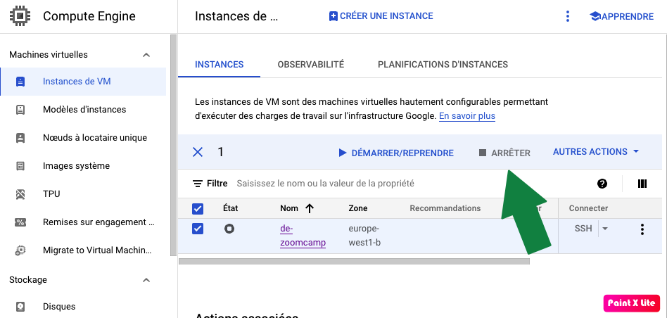

## Table of content

- <a href ="#1"> 1 . Steps for Creating a New Project in GCP </a>
- <a href ="#2">2. Create the VM instance</a>
- <a href ="#3">3. Generate SSH keys</a>
- <a href ="#4">3. Create the VM Instance</a>
- <a href ="#5">5. SSH into the VM</a>
- <a href ="#6">6. Download and install Anaconda</a>
- <a href ="#7">7. Configure VM and setup local ~/.ssh/config</a>
- <a href ="#8">8. Install docker & Setup the VScode to SSH directly</a>
- <a href ="#9">9. Configure the VM</a>
	- <a href ="#9.1">9.1. Pull the git repo of the course</a>
	- <a href ="#9.2">9.2. Docker Configuration</a>
	- <a href ="#9.3">9.3. Install docker-compose</a>
- <a href ="#10">10. Launch with docker compose the course image</a>
- <a href ="#11">11. Install PGCLI (command line interface for Postgres)</a>
- <a href ="#12">12. Port forward : postgres, pgAdmin and Jupyter in our local machine</a>
	- <a href ="#12.1">12.1. Postgres</a>
	- <a href ="#12.2">12.2. PgAdmin</a>
	- <a href ="#12.3">12.3. Jupyter</a>
- <a href ="#13">13. Run upload-data notebook, create database and populate it (via this notebook)</a>
- <a href ="#14">14. Terraform</a>
	- <a href ="#14.1">14.1. Install terraform</a>
	- <a href ="#14.2">14.2. SFTP Google credentials To the VM</a>
	- <a href ="#14.3">14.3. Configure the Google Cloud CLI</a>
	- <a href ="#14.4">14.4. Run Terraform Commands</a>
- <a href ="#15">15. Shut down the VM and Update the config file</a>

## <a name = "1">1. Steps for Creating a New Project in GCP</a>

- Go to the [Google Cloud Console](https://console.cloud.google.com/) and sign in to your Google account.
- Click on the project drop-down and select or create the project that you want to use for the new project.
- In the Navigation menu, click on the "IAM & admin" button, then select "Settings."
- Under the "Project settings" tab, click on the "New Project" button.
- Enter a name for your new project and select a billing account (if you haven't created one yet, you can do so now by clicking on the "Create billing account" button).
- Choose a location for your project's resources and click "Create."
- Once the project is created, you will be redirected to the project's dashboard. From here, you can access all of the services and resources associated with your project.
- To enable the Google Cloud services that you need for your project, click on the "Enable API's and Services" button on the dashboard and select the services you need.
- In order to access the resources of your project, you need to create credentials. Go to the navigation menu and click on the "IAM & admin" button, then select "Credentials."
- Click on "Create credentials" and select the type of credentials you need.

## <a name = "2">2. Create the VM instance</a>

- In the menu select Compute Engine and then VM Instances.


![[vm_instances.png]]


## <a name = "3">3. Generate SSH keys</a>

In the terminal :
- Go to the ssh folder : ``` cd ~/.ssh```

- Generate the ssh key (following gcp documentation) : 
	- ```ssh-keygen -t rsa -f gcp -C panayotis -b 2048``` (leave empty the passphrase)

 - Now the two keys are ready gcp and gcp.pub (public).
 
- Go now to **Metadata** in the GCP platform to pair the public key.

- Print the public key ```cat gcp.pub``` and copy peaste it to the ssh keys tab.


## <a name = "4">4. Create the VM Instance</a>

- Go back to VM Instances and make sure you are in the correct project (upper left).
- Click to create new instance.
- Set the following setup and click create.

![[vm_setup.png]]


## <a name = "5">5. SSH into the VM</a>

- Copy the External IP from the created instance.
- In the terminal : ```ssh -i ~/.ssh/gcp panayotis@34.78.171.148``` with ~/.ssh/gcp the **private key** and **panayotis** the name used for generating the key and **34.78.171.148** the copied External IP.

## <a name = "6">6. Download and install Anaconda</a>

- In the terminal : ```wget https://repo.anaconda.com/archive/Anaconda3-2022.10-Linux-x86_64.sh```the Linux version of Anaconda (from official website anaconda.com)
- Run : ```bash Anaconda3-2022.10-Linux-x86_64.sh```
- Answer yes to the two questions during the installation (license agreement & conda init).
- Now every time we login the (base) environment is directly launched.
- Don't forget to lougout and login to activate the first time (or ```source .bashrc```).

## <a name = "7">7. Configure VM and setup local ~/.ssh/config</a>
  
Configure the **config** for a easier connection with ssh.
- Go to the ssh folder : ```cd ~/.ssh```
- Create a file called config : ```touch config```
- Open in Vscode with the following command : ```code config```
- Add the following infos :

```
Host de-zoomcamp

HostName XX.XX.XXX.XXX (the external ID)

User panayotis

IdentityFile
```


## <a name = "8">8. Install docker & Setup the VScode to SSH directly</a>

- Run in the terminal : ```sudo apt-get update``` and ```sudo apt-get install docker.io``` (in the VM
- In VScode go to the extensions and search Remote ssh.
- Install the extension.
- Click on the remote window (as shown in the second image below).
- Select in the upper selection tab : Connect to Host
- It will detect automatically the de-zoomcamp connection (thanks to the config file).
- The VSCode will relaunch directly on the VM.

![[vscode_rm_ssh_1.png]]

![[vscode_rm_ssh_2.png]]

![[vscode_rm_ssh_3.png]]


## <a name = "9">9. Configure the VM</a>


### <a name = "9.1">9.1. Pull the git repo of the course</a>
- Inside the terminal of the VM : ```git clone https://github.com/DataTalksClub/data-engineering-zoomcamp.git```


### <a name = "9.2">9.2. Docker Configuration</a>

- Run in the terminal : ```docker run hello-world````
- An error occured :

```

docker: Got permission denied while trying to connect to the Docker daemon socket at unix:///var/run/docker.sock: Post "http://%2Fvar%2Frun%2Fdocker.sock/v1.24/containers/create": dial unix /var/run/docker.sock: connect: permission denied. See 'docker run --help'.

```

- We need to give permissions (detailed instructions in this link https://github.com/sindresorhus/guides/blob/main/docker-without-sudo.md):
- ```sudo groupadd docker``` (says that the group already exists)
- ```sudo gpasswd -a $USER docker``` (Adding user panayotis to group docker)
- ```sudo service docker restart``` (restart docker deamon)
- Logout and login !
- Hit ```docker run hello-world``` to see that it works!
### <a name = "9.3">9.3. Install docker-compose</a>

- Go to docker compose repo (https://github.com/docker/compose), go to the lastest release.
- Find the linux version (docker-compose-linux-x86_64) and copy the link address.
- Make a dir bin and download the docker compose inside and make it executable :
- ```mkdir bin```
- ```cd bin``` (to store all the executables)
- ```wget https://github.com/docker/compose/releases/download/v2.15.1/docker-compose-linux-x86_64 -O docker-compose``` (specify that the output is called docker-compose)
- ```chmod +x docker-compose``` (make docker-compose executable, after this the name of docker-compose is colored in green)
- ```./docker-compose version``` (check the version)
- Add to the path directory in order to call it from anywhere.
- ```cd ..``` (exit from the bin directory)
- ```nano .bashrc``` (edit the bashrc file)
- Add at the end`of the file the following command : ```export PATH="${HOME}/bin:${PATH}"```
- ```source .bashrc``` (take the changes into account)
- Now the docker-compose ca be called from anywhere.


## <a name = "10">10.  Launch with docker compose the course image</a>

- Go to the docker folder of the first week : ```cd data-engineering-zoomcamp/week_1_basics_n_setup/2_docker_sql/```
- Because of the existence of the docker-compose.yaml we can run the ```docker-compose up -d``` (-d for detach mode).
- When the dowloading/creation is finished run ```docker ps``` to see the created containers (see following image).
- The docker compose yaml file contains two images (postgres and pgadmin).
![[docker_ps_cmd.png]]

![[docker_compose_yaml.png]]
## <a name = "11">11.  Install PGCLI (command line interface for Postgres )</a>

- **Install via conda**,is better than pip for this package.
- Open data engineering folder inside the VSCode but be sure that wa are connected via ssh to the VM.
- In the terminal : ```conda install -c conda-forge pgcli```
- Run also this directly ```pip install -U mycli```
- Test the installation : ```pgcli -h localhost -U root -d ny_taxi```
- If it asks the root password and you don't have already set it you can do it with the following command :```sudo passwd```
- Now (after the ```pgcli -h localhost -U root -d ny_taxi```) you can test with ```\dt``` command to see the list of tables (ignore the red warning).
- To exit : CTRL+D

![[pgcli.png]]

## <a name = "12">12. Port forward : postgres, pgAdmin and Jupyter in our local machine</a>
  
### <a name = "12.1">12.1. Postgres</a>

- With the ```docker ps```we see that the postgres is located in the port 5432.
- To interact with this postgres locally we need to forward this port.
- Go to the VSCODE (be sure to open the ssh remote folder).
- Click on the PORT tab and enter the port to be forwarded (as shown in the second image below).
- To test it, open another terminal (without ssh on the VM) and hit ```pgcli -h localhost -U root -d ny_taxi```.

### <a name = "12.2">12.2. PgAdmin</a>

- With the ```docker ps```we see that the postgres is located in the port 8080.
- We can also forward the port 8080 and then go to the http://localhost:8080/ address in the web browser to open the pgadmin interface.
- The default credentials are username : admin@admin.com and the password : root.

### <a name = "12.3">12.3. Jupyter</a>
  
- In the terminal inside the VM go to folder where the *upload-data.ipynb* notebook is located (```cd data-engineering-zoomcamp/week_1_basics_n_setup/2_docker_sql/```).
- Launch the jupyter notebook with :```jupyter notebook```.
- Forward now the port 8888.
- Be carefull you should read the Local Address proposed automatically in the PORT TAB (in my case the local port 8888 was already taken and it was setted at http://localhost:64565/).
- Don't be confused with the address given in the vm terminal which it will always be localhost:8888...
- Copy past the correct address (i.e. http://localhost:64565/) in your local web browser and copy paste the token generate in the vn terminal (after the ```jupyter notebook``` command).


![[docker_ps_cmd.png]]
![[port_forwarding.png]]


## <a name = "13">13. Run upload-data notebook, create database and populate it (via this notebook)</a>

- Download the data with this command ```wget https://github.com/DataTalksClub/nyc-tlc-data/releases/download/yellow/yellow_tripdata_2019-01.csv.gz```
- Unzip and delete zip file in one command ```gzip -d yellow_tripdata_2019-01.csv.gz```.
- Running the different cells of this notebook we can create a new table in our database ny_taxi.
- Open a terminal in parallel (inside) and connect to the database (```pgcli -h localhost -U root -d ny_taxi```).
- When in the notebook this command is executed (```df.head(n=0).to_sql(name='yellow_taxi_data', con=engine, if_exists='replace')```)
- You can list the availabe tables in the postgres ```\dt``` before and after.

![[postgres_before_after.png]]

## <a name = "14">14. Terraform</a>

### <a name = "14.1">14.1. Install terraform</a>

- Go to the bin directory : ```cd ~/bin```
- Then : ```wget https://releases.hashicorp.com/terraform/1.3.7/terraform_1.3.7_linux_amd64.zip```
- Unzip the archive (if it needed ```sudo apt install unzip```) : ```unzip terraform_1.3.7_linux_amd64.zip```
- Remove the archive : ```rm terraform_1.3.7_linux_amd64.zip```
- The terraform is already executable (in green) and the bin folder is already in the path.
- Go to the desired folder : ```cd /data-engineering-zoomcamp/week_1_basics_n_setup/1_terraform_gcp/terraform```
- Test terraform : ```terraform version```

### <a name = "14.2">14.2. SFTP Google credentials To the VM</a>

- Create the json credentials for this service :
	1.  In the Google Cloud console, go to Menu menu > IAM & Admin > Service Accounts. Go to Service Accounts.
	2.  Select your service account.
	3.  Click Keys > Add key > Create new key.
	4.  Select JSON, then click Create. 
	5.  Click Close.

I stored the json (```ny-rides-panayotis.json```) file inside a folder called .gc and I remove the numbers from the name of the file.

- Use SFTP to transfer this file to the server:
	1. In the local terminal : ```sftp de-zoomcamp```  (now we are connected in the vm)
	2. Create a directory .gc and go inside : ```mkdir .gc``` and ```cd .gc```
	3. Now we can put the file inside the vm : ```put ny-rides-panayotis.json```

### <a name = "14.3">14.3. Configure the Google Cloud CLI</a>

- Set up the google application credentials to point to the environemental variables : ```export GOOGLE_APPLICATION_CREDENTIALS=~/.gc/ny-rides-panayotis.json```
- Authenticate the CLI : ```gcloud auth activate-service-account --key-file $GOOGLE_APPLICATION_CREDENTIALS```

![[auth_gcloud_cli.png]]

### <a name = "14.4">14.4. Run Terraform Commands</a>

- Go to the terraform folder of the project : ```cd ~/data-engineering-zoomcamp/week_1_basics_n_setup/1_terraform_gcp/terraform/```
- Initialize terraform : ```terraform init```
![[terraform_init.png]]
- Run the command : ```terraform plan```
- The GCP Project ID is the name of the project : ny-rydes-panayotis
![[project_id.png]]

- Optionally you can configure your terraform files (`variables.tf`) to include your project id:
```bash
variable "project" {
	description = "Your GCP Project ID"
	default = "ny-rides-alexey"
	type = string
}
```

- Run now : `terraform apply` and hit yes.
- If you get an error like that:
> Error: googleapi: Error 403: terraform@ny-rides-panayotis.iam.gserviceaccount.com does not have
> storage.buckets.create access to the Google Cloud project., forbidden  

Then you need to give your service account all the permissions. 


## <a name = "15">15. Shut down the VM and Update the config file</a>

### <a name = "15.1">15.1 From the terminal</a>

- Run the command : `sudo shutdown now`

### <a name = "15.2">15.2 From the web interface</a>

- From the web :


### <a name = "15.3">15.3 Update the config file</a>

- When you start the vm you need to copy the new external IP.
- Replace the with this new external IP in the config file : ```nano ~/.ssh/config```
